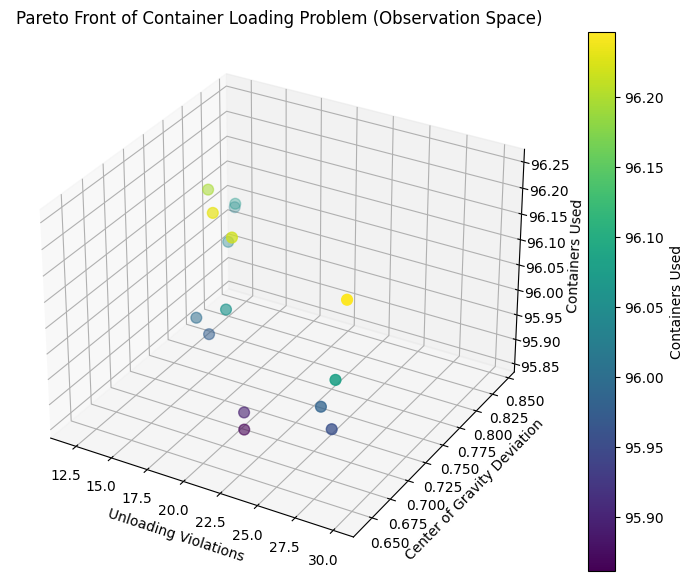

# MODA Cargo Optimiser: NSGA-II Pareto Optimisation for Container Loading

A multi-objective optimisation project for container placement on a cargo vessel using **NSGA-II** and **Pareto-front analysis**.

The project models a simplified container-loading problem where containers must be assigned to vessel slots while balancing unloading order, vessel stability, slot utilisation, and stacking feasibility. The goal is not to produce one “perfect” loading plan. The goal is to generate a set of strong trade-off solutions that a logistics planner can compare.

## Project Snapshot

| Area                | Details                                                                                                                                                                       |
| ------------------- | ----------------------------------------------------------------------------------------------------------------------------------------------------------------------------- |
| **Status**          | Complete                                                                                                                                                                      |
| **Problem**         | Generate feasible container-loading layouts while balancing unloading practicality, vessel balance, slot utilisation, and stacking constraints                                |
| **Approach**        | Constrained NSGA-II optimisation produces a Pareto front of trade-off solutions rather than a single hidden weighted-score answer                                             |
| **Tech**            | Python, `pymoo`, NSGA-II, NumPy, Pandas, Matplotlib, Jupyter                                                                                                                  |
| **Data**            | Synthetic container weights and unloading-priority data                                                                                                                       |
| **Reproducibility** | Install dependencies with `pip install -r requirements.txt`, then run `container_ship_nsga_v2.ipynb`                                                                          |
| **Validation**      | Duplicate-slot, unsupported-stack, and unsafe weight-stack constraints; exported Pareto solutions and 3D layout visualisations                                                |
| **Key result**      | On the default synthetic vessel configuration, selected Pareto solutions use all 96 available slots while exposing different unloading-order and centre-of-gravity trade-offs |
| **Scope**           | Decision-support prototype, not an industrial vessel-stability or port-scheduling solver                                                                                      |


## Repository Summary

| Field         | Details                                                                                                      |
| ------------- | ------------------------------------------------------------------------------------------------------------ |
| Project type  | Multi-objective optimisation                                                                                 |
| Domain        | Logistics, vessel loading, operations research                                                               |
| Algorithm     | NSGA-II                                                                                                      |
| Library       | `pymoo`                                                                                                      |
| Language      | Python                                                                                                       |
| Main notebook | `container_ship_nsga_v2.ipynb`                                                                               |
| Data          | Synthetic container weights and unloading priorities                                                         |
| Main outputs  | Pareto solutions, constraint metrics, 3D layout visualisations                                               |
| Core skills   | Constraint modelling, Pareto optimisation, evolutionary algorithms, logistics simulation, decision analytics |

## Problem

Container loading is not only a packing problem.

A useful vessel-loading plan must balance several competing goals:

* Keep unloading order practical
* Maintain stable weight distribution
* Use vessel slots efficiently
* Avoid duplicate slot assignments
* Avoid unsupported stacks
* Avoid unsafe heavy-over-light stacking patterns
* Keep the final layout interpretable for operations teams

These objectives conflict. A layout that improves slot utilisation may create stacking issues. A layout that improves unloading order may affect balance. A layout that improves balance may require less convenient placement.

That makes the problem suitable for **multi-objective optimisation**.

## First-Principles View

The real question is not:

```text
Can we place containers into available slots?
```

The better question is:

```text
Can we generate feasible loading layouts that balance unloading order, vessel stability, and capacity usage?
```

A single weighted score would hide important trade-offs. NSGA-II is useful because it produces a Pareto front, where each solution represents a different operational compromise.

## Solution

The project formulates vessel loading as a constrained multi-objective assignment problem.

Each candidate solution assigns containers to vessel slots:

```text
x[i] = slot assigned to container i
```

The optimiser evaluates each layout using three objectives:

| Objective                   | Direction | Meaning                                                     |
| --------------------------- | --------- | ----------------------------------------------------------- |
| Unloading violations        | Minimise  | Reduce cases where unloading order is operationally awkward |
| Centre-of-gravity deviation | Minimise  | Keep weight distribution close to the vessel centre         |
| Used slots                  | Maximise  | Increase slot utilisation                                   |

Because `pymoo` minimises objectives by default, slot utilisation is encoded as:

```text
-used_slots
```

This allows the optimiser to reward higher utilisation while staying compatible with minimisation.

## Vessel Layout

The vessel is represented as a 3D grid:

```text
Bays × Rows × Tiers
```

Default configuration:

```text
8 bays × 4 rows × 3 tiers = 96 available positions
```

Each slot is represented as:

```text
(bay, row, tier)
```

Each synthetic container has:

| Attribute    | Meaning                     |
| ------------ | --------------------------- |
| Container ID | Unique container identifier |
| Weight       | Synthetic container weight  |
| Priority     | Unloading priority group    |

## Constraints

| Constraint                | Purpose                                                      |
| ------------------------- | ------------------------------------------------------------ |
| Duplicate slot assignment | Prevent multiple containers from occupying the same slot     |
| Unsupported stack         | Prevent containers from being placed above empty lower tiers |
| Unsafe weight stack       | Penalise unsafe heavy-over-light stacking patterns           |

In `pymoo`, constraints are feasible when:

```text
G <= 0
```

Since this project uses violation counts, a value of `0` means feasible and a positive value means a constraint violation exists.

## Algorithm

The project uses **NSGA-II**, a genetic algorithm designed for multi-objective optimisation.

NSGA-II is suitable because:

* The assignment search space is large
* The objectives conflict
* Constraints are non-trivial
* There is no single universally best layout
* Decision-makers need trade-off options, not one hidden weighted score

## OODA Summary

### Observe

Container loading requires trade-offs across unloading sequence, stability, capacity usage, and stacking feasibility.

### Orient

A single-objective optimiser would hide trade-offs. A multi-objective method is better because the final decision depends on operational priorities.

### Decide

Use NSGA-II to generate a Pareto front of candidate loading layouts.

### Act

Generate synthetic container data, optimise layouts, export Pareto solutions, visualise layouts, and summarise trade-offs for decision support.

## Project Structure

```text
MODA-Cargo-Optimiser-NSGA-II-Pareto-optimisation-logistics-/
│
├── README.md
├── LICENSE
├── .gitignore
├── requirements.txt
├── MODA25A2_42.pdf
├── container_ship_nsga_v2.ipynb
│
├── assets/
│   ├── pareto-front.png
│   ├── selected-layout-3d.png
│   ├── optimisation-workflow.png
│   └── objective-comparison.png
│
└── results/
    ├── pareto_solutions.csv
    ├── experiment-summary.md
    ├── results-discussion.md
    └── raw_nsga2_output.txt
```

## Installation

Clone the repository:

```bash
git clone https://github.com/neeilnandal/MODA-Cargo-Optimiser-NSGA-II-Pareto-optimisation-logistics-.git
cd MODA-Cargo-Optimiser-NSGA-II-Pareto-optimisation-logistics-
```

Create a virtual environment:

```bash
python -m venv venv
```

Activate the environment.

On macOS or Linux:

```bash
source venv/bin/activate
```

On Windows:

```bash
venv\Scripts\activate
```

Install dependencies:

```bash
pip install -r requirements.txt
```

## Requirements

```text
numpy
pandas
matplotlib
pymoo
jupyter
```

## How to Run

Open the notebook:

```bash
jupyter notebook container_ship_nsga_v2.ipynb
```

Then run all cells.

The notebook performs the following workflow:

```text
Generate synthetic container data
        ↓
Create vessel slot grid
        ↓
Define objectives and constraints
        ↓
Run NSGA-II optimisation
        ↓
Extract Pareto-optimal solutions
        ↓
Select representative solution
        ↓
Export results and visualisations
```

## Results

The optimiser generated a Pareto front of candidate loading layouts.

The clean decision-ready summary is stored in:

```text
results/pareto_solutions.csv
```

Example Pareto solutions:

| Solution | Unloading Violations | CoG Deviation | Used Slots | Interpretation                                                             |
| -------- | -------------------: | ------------: | ---------: | -------------------------------------------------------------------------- |
| S001     |                   29 |      0.646651 |         96 | Balanced solution with moderate unloading violations and strong slot usage |
| S002     |                   15 |      0.753381 |         96 | Best unloading-order solution with slightly worse balance                  |
| S003     |                   30 |      0.639909 |         96 | Best balance-focused solution with higher unloading violations             |
| S004     |                   19 |      0.700328 |         96 | Middle-ground compromise between unloading order and balance               |
| S005     |                   17 |      0.715040 |         96 | Low violation count with moderate balance trade-off                        |

The third optimiser objective is internally represented as `-96` because `pymoo` minimises all objectives. In plain terms, this corresponds to 96 used vessel slots.

## Decision Interpretation

There is no single “best” loading plan.

The recommended solution depends on the operational priority:

| Priority                     | Recommended Solution                              |
| ---------------------------- | ------------------------------------------------- |
| Minimise unloading conflicts | S002                                              |
| Improve vessel balance       | S003                                              |
| Balanced compromise          | S004                                              |
| Strong slot utilisation      | Any Pareto solution shown, since all use 96 slots |

A logistics planner should not choose the solution with the lowest value in only one column. The value of the Pareto front is that it exposes trade-offs clearly.

## Visual Outputs

Recommended visual assets:

```text
assets/pareto-front.png
assets/selected-layout-3d.png
assets/optimisation-workflow.png
assets/objective-comparison.png
```

Use them in the README like this:

```markdown


```

## Scientific and Optimisation Skills Demonstrated

This project demonstrates:

* Multi-objective optimisation
* Evolutionary algorithms
* NSGA-II
* Pareto-front analysis
* Constraint modelling
* Synthetic data generation
* Integer assignment representation
* Logistics simulation
* Vessel-loading decision support
* 3D visualisation
* Trade-off analysis

The scientific value is in the modelling of competing objectives and constraints. This is not intended to be a full industrial vessel-loading solver.

## Security and Data Notes

This project is low-risk from a data-security perspective.

| Area                  | Status                        |
| --------------------- | ----------------------------- |
| API keys              | None                          |
| Secrets               | None                          |
| User data             | None                          |
| Customer data         | None                          |
| External file uploads | None                          |
| Dataset               | Synthetic                     |
| Privacy risk          | Low                           |
| Main dependency risk  | `pymoo` version compatibility |

Recommended hygiene:

* Do not commit private manifests or real logistics data
* Keep generated results reproducible with a fixed random seed
* Pin dependency versions if exact reproducibility is required
* Avoid presenting synthetic data as real operational data

## Limitations

* Synthetic data only
* Simplified vessel geometry
* Simplified centre-of-gravity proxy
* No crane sequencing
* No port schedule constraints
* No hazardous-material separation rules
* No refrigerated-container slot constraints
* No real-world vessel trim or hydrostatic stability model
* NSGA-II performance may vary with population size, generations, and random seed

## Future Improvements

* Convert the notebook into a standalone Python script
* Add repeated runs across multiple random seeds
* Add sensitivity analysis for population size and generation count
* Add crane-move minimisation
* Add hazardous-material separation rules
* Add reefer container slot constraints
* Add port-sequence modelling
* Add more realistic vessel stability constraints
* Add Plotly-based interactive 3D visualisation
* Add Streamlit dashboard for Pareto-front exploration
* Add automated smoke tests for result generation

## Founder-Style Product Diagnosis

| Question                | Answer                                                                                        |
| ----------------------- | --------------------------------------------------------------------------------------------- |
| User                    | Logistics planner, shipping analyst, operations research student, AI portfolio reviewer       |
| Pain point              | Container loading trade-offs are hard to compare manually                                     |
| Smallest useful version | Synthetic optimiser that exposes trade-offs between unloading order, balance, and utilisation |
| Output                  | Pareto-front solutions, layout visualisation, and decision-ready CSV summaries                |
| Why it matters          | It turns optimisation output into operational decision support                                |

## Final Verdict

This project is positioned as a **controlled optimisation prototype**, not as a production shipping solver.

Its value is that it shows how multi-objective optimisation can turn a messy logistics planning problem into a set of interpretable decision options. That is exactly the kind of thinking needed in AI engineering, data science, operations research, and decision intelligence roles.

## Portfolio One-Liner

Built a Python-based NSGA-II cargo loading optimiser that generates Pareto-efficient vessel loading layouts by balancing unloading order, centre-of-gravity deviation, slot utilisation, and stacking feasibility.


